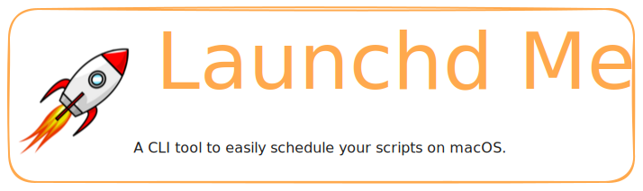
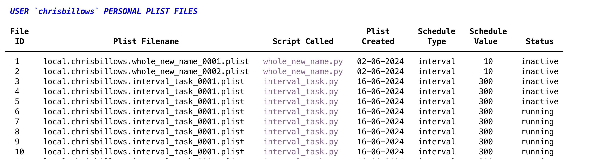

<style>
  .md-typeset h1,
  .md-content__button {
    display: none;
  }
</style>



## Features

- Run your Python script every 5 minutes, every day or every week, with one command
- Uses macOS's recommended scheduling utility `launchd` ([what is launchd?](what_is_launchd.md))
- Automate the creation of `launchd` plist files
- Display the status of all your plist files

## Why not just use a `cron` job

Apple recommends it's own `launchd` system over cron (see [here]([text](https://developer.apple.com/library/archive/documentation/MacOSX/Conceptual/BPSystemStartup/Chapters/ScheduledJobs.html#//apple_ref/doc/uid/10000172i-CH1-SW2)).)
Recent macOS security changes make using `cron` more and more difficult.

I wanted an easy way to schedule my own scripts. Hence `launchd me`.

## Basic usage

### Schedule a script

The basic command is structured like this:

```
launchd-me <script_to_automate> <schedule_type> <schedule>
```

For example, to run `your_script.py` once every hour you'd run:

```
launchd-me your_script.py calendar {Hour: 1}
```

That's it!

(Jump to the User Guide for more on [Schedule types])


### View your scheduled scripts


```
launchd-me list
```

You will see an output like this:




### Stop a scheduled script

```
launchd-me
```

You can also do this directly using `launchctl`.  Nothing LaunchdMe

For more on how to use `launchd me` head to the user guide.


## Installation

### Requirements

Requires Python 3.9, 3.10, 3.11, 3.12.

Currently only tested on macOS Sonoma 14.5.

### Quick install

```
pip install launchd-me
```

As always, installing into a virtual environment is recommended.

??? note "If virtual environments are new to you..."

    This is a great article.  You can start with [how]([text](https://realpython.com/python-virtual-environments-a-primer/#why-do-you-need-virtual-environments)) and [why]([text](https://realpython.com/python-virtual-environments-a-primer/#why-do-you-need-virtual-environments)). (Via the brilliant [Real Python](https://realpython.com/).


### Better install

Use the awesome [pipx](https://github.com/pypa/pipx) to make Launchd Me available
system wide. Install pipx with the [three commands](https://github.com/pypa/pipx#install-pipx)) then run:

```
pipx install launchd-me
```
